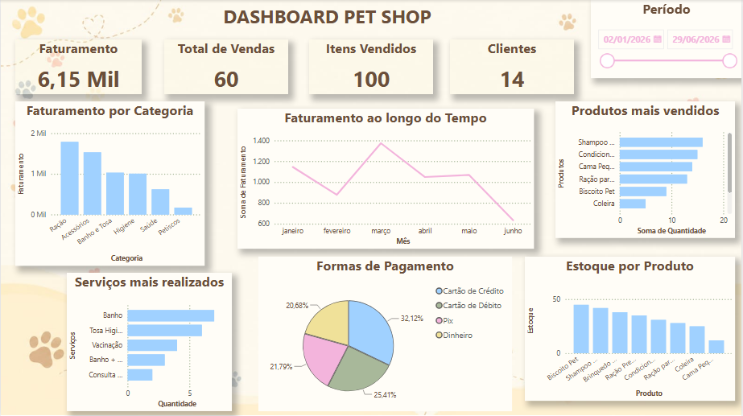

# 🐾 Dashboard Pet Shop

## 📊 Sobre o projeto

Dashboard desenvolvido no Power BI para análise de vendas, produtos, serviços, formas de pagamento e estoque de um Pet Shop fictício.

## 🎯 Objetivo

O dashboard foi criado para facilitar a visualização e análise de informações importantes do negócio, como:

- Faturamento total
- Quantidade de vendas
- Itens vendidos
- Clientes
- Faturamento ao longo do tempo
- Faturamento por categoria
- Produtos mais vendidos
- Serviços mais realizados
- Formas de pagamento
- Estoque por produto

## 🛠️ Ferramentas utilizadas

- **Power BI**
- **Power Query**
- **GitHub**

## 📈 Dashboard

## 📁 Arquivos

- **DashboardPetShop.png** — imagem do dashboard.
- **Análise_PetShop.pbix** — arquivo `.pbix` utilizado para desenvolver o projeto.

## 📌 Observação

Os dados utilizados neste projeto são fictícios e foram criados exclusivamente para fins de estudo e portfólio.

## 📚 Considerações finais 

O desenvolvimento deste projeto possibilitou aplicar conhecimentos relacionados à organização, tratamento e análise de dados utilizando o Power BI. A construção do dashboard permitiu transformar dados fictícios em informações visuais, facilitando a compreensão de indicadores relacionados às vendas, produtos, serviços e estoque do Pet Shop.
Além da prática com a ferramenta, o projeto contribuiu para o desenvolvimento de habilidades relacionadas à análise de dados, criação de visualizações e apresentação de informações de forma clara e objetiva. A experiência também proporcionou a aplicação de conhecimentos que podem ser utilizados em futuros projetos acadêmicos e profissionais.

💛Autora
Larissa Cruz
Estudante de Análise e Desenvolvimento de Sistemas (ADS)

Projeto desenvolvido para fins acadêmicos e de portfólio.
